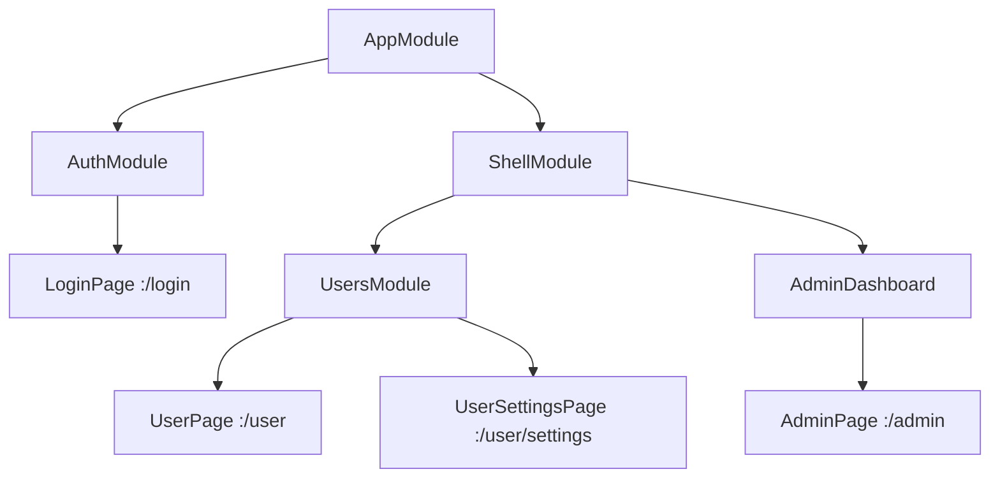

# 👶 ChildRoute vs 🧩 ModuleRoute

Understanding the difference between `ChildRoute` and `ModuleRoute` is essential for building scalable and maintainable apps with GoRouter Modular.

## 👶 ChildRoute

A `ChildRoute` defines a single page (screen) in your app. It is used for simple navigation where you want to display a widget directly.

**When to use:**
- For individual pages/screens (e.g., Home, Profile, Settings)
- When you don't need to group routes or manage dependencies for a set of pages

**Example:**
```dart
class HomeModule extends Module {
  @override
  List<ModularRoute> get routes => [
    ChildRoute('/', child: (context, state) => HomePage()),
    ChildRoute('/profile', child: (context, state) => ProfilePage()),
  ];
}
```

## 🧩 ModuleRoute

A `ModuleRoute` defines a nested module, grouping multiple routes and their dependencies. It is used for modularizing your app, allowing for better separation of concerns and code organization.

**When to use:**
- When you want to group related routes (e.g., all user-related pages)
- When you need to inject dependencies that are shared among a set of routes
- For large apps with multiple features or teams

**Example:**
```dart
class AppModule extends Module {
  @override
  List<ModularRoute> get routes => [
    ModuleRoute('/', module: HomeModule()),
    ModuleRoute('/auth', module: AuthModule()),
  ];
}
```

## 🔗 Module Nesting (ModuleRoute inside ModuleRoute)

A powerful feature of `ModuleRoute` is that you can nest modules as deeply as needed. A `ModuleRoute` can contain other `ModuleRoute`s, allowing you to build complex and scalable navigation structures.

**Example:**
```dart
class AppModule extends Module {
  @override
  List<ModularRoute> get routes => [
    ModuleRoute('/', module: HomeModule()),
    ModuleRoute('/admin', module: AdminModule()),
  ];
}

class AdminModule extends Module {
  @override
  List<ModularRoute> get routes => [
    ModuleRoute('/users', module: UsersModule()),
    ChildRoute('/dashboard', child: (context, state) => AdminDashboard()),
  ];
}
```

In this example, navigating to `/admin/users` will load the `UsersModule` inside the `AdminModule`, which is inside the `AppModule`.

### 📊 Simple Flow Example

Below is a simple flow to illustrate nested modules:



This structure allows you to keep features isolated, manage dependencies per module, and scale your app easily.

## 🔍 Key Differences

|                | ChildRoute                        | ModuleRoute                        |
|----------------|-----------------------------------|------------------------------------|
| Purpose        | Single page/screen                | Group of routes (feature/module)   |
| Dependencies   | No shared binds                   | Can inject shared binds            |
| Nesting        | Cannot contain other routes       | Can contain ChildRoutes, Shell, etc|
| Use case       | Simple navigation                 | Modular, scalable architecture     |

## 💡 Tips
- Use `ChildRoute` for simple, isolated pages.
- Use `ModuleRoute` to group related pages and manage dependencies together.
- You can nest modules as deep as needed for complex apps.
- Always keep your route structure clean and organized for better maintainability.

## 📚 Related Topics
- [Routes Overview](./routes_overview) - Learn about all route types
- [Navigation](./navigation) - How navigation works
- [Project Structure](./project-structure) - Organize your modules

