# 🎭 Event System

The Event System enables **decoupled communication** between modules, perfect for **micro frontend architectures** where teams work independently.

## 🚀 Creating Event Modules

### **Basic Event Module**
```dart
class NotificationModule extends EventModule {
  @override
  List<ModularRoute> get routes => [
    ChildRoute('/', child: (context, state) => NotificationPage()),
  ];

  @override
  void listen() {
    on<ShowNotificationEvent>((event, context) {
      if (context != null) {
        ScaffoldMessenger.of(context).showSnackBar(
          SnackBar(content: Text(event.message)),
        );
      }
    });
  }
}

class ShowNotificationEvent {
  final String message;
  ShowNotificationEvent(this.message);
}
```

### **Event with Data**
```dart
class UserLoggedInEvent {
  final User user;
  final DateTime timestamp;
  
  UserLoggedInEvent(this.user, this.timestamp);
}

class AuthModule extends EventModule {
  @override
  void listen() {
    on<UserLoggedInEvent>((event, context) {
      // Handle user login
      print('User ${event.user.name} logged in at ${event.timestamp}');
      
      // Navigate to dashboard
      if (context != null) {
        context.go('/dashboard');
      }
    });
  }
}
```

## 🌐 Global Events

### **Register Global Listeners**
```dart
// Register global listener
ModularEvent.instance.on<UserLoggedOutEvent>((event, context) {
  if (context != null) context.go('/login');
});

// Fire global events
ModularEvent.fire(UserLoggedOutEvent());
```

### **Module-Specific Events**
```dart
class CartModule extends EventModule {
  @override
  void listen() {
    on<ProductAddedEvent>((event, context) {
      // Add to cart logic
      addToCart(event.product);
      
      // Fire another event
      ModularEvent.fire(CartUpdatedEvent());
    });
  }
}
```

## 🎯 Context-Aware Events

### **NavigatorContext Usage**
```dart
class NotificationModule extends EventModule {
  @override
  void listen() {
    on<ShowDialogEvent>((event, context) {
      if (context != null) {
        showDialog(
          context: context,
          builder: (context) => AlertDialog(
            title: Text(event.title),
            content: Text(event.message),
            actions: [
              TextButton(
                onPressed: () => Navigator.of(context).pop(),
                child: Text('OK'),
              ),
            ],
          ),
        );
      }
    });
  }
}
```

### **Why Context Can Be Null**
The `NavigatorContext` can be null when:
- The event is fired before any widget is built
- The module is not currently active in the navigation stack
- The event is fired from a background service

## 🔄 Event Communication Patterns

### **Request-Response Pattern**
```dart
class DataRequestEvent {
  final String id;
  final Function(String data) onResponse;
  
  DataRequestEvent(this.id, this.onResponse);
}

class DataModule extends EventModule {
  @override
  void listen() {
    on<DataRequestEvent>((event, context) async {
      final data = await fetchData(event.id);
      event.onResponse(data);
    });
  }
}

// Usage
ModularEvent.fire(DataRequestEvent('user-123', (data) {
  print('Received data: $data');
}));
```

### **Broadcast Pattern**
```dart
class ThemeChangedEvent {
  final bool isDarkMode;
  ThemeChangedEvent(this.isDarkMode);
}

class ThemeModule extends EventModule {
  @override
  void listen() {
    on<ThemeChangedEvent>((event, context) {
      // Update theme across all modules
      updateTheme(event.isDarkMode);
    });
  }
}
```

## 🧩 Micro Frontend Example

### **E-commerce Architecture**

```mermaid
graph TD
    A[🏪 E-commerce App] --> B[🛒 Cart Module]
    A --> C[📦 Product Module]  
    A --> D[💳 Payment Module]
    A --> E[🔔 Notification Module]
    
    B --> F[Cart Controller]
    B --> G[Cart Page]
    
    C --> H[Product Service]
    C --> I[Product List Page]
    
    D --> J[Payment Service]
    D --> K[Checkout Page]
    
    E --> L[Toast & Dialog Service]
    
    M[🎭 Event Bus] -.->|ProductAddedEvent| B
    M -.->|CartUpdatedEvent| C
    M -.->|PaymentSuccessEvent| B
    M -.->|All Events| E
```



### **Cart Module (Team A)**
```dart
class CartModule extends EventModule {
  @override
  void listen() {
    on<ProductAddedEvent>((event, context) {
      // Add to cart logic
      addToCart(event.product);
      
      // Notify other modules
      ModularEvent.fire(CartUpdatedEvent());
    });
    
    on<PaymentSuccessEvent>((event, context) {
      // Clear cart after successful payment
      clearCart();
    });
  }
}
```

### **Product Module (Team B)**
```dart
class ProductModule extends EventModule {
  @override
  void listen() {
    on<CartUpdatedEvent>((event, context) {
      // Update product availability
      updateProductAvailability();
    });
  }
}
```

### **Payment Module (Team C)**
```dart
class PaymentModule extends EventModule {
  @override
  void listen() {
    on<CartUpdatedEvent>((event, context) {
      // Update payment totals
      updatePaymentTotals();
    });
  }
}
```

## 🎨 Advanced Event Patterns

### **Event with Validation**
```dart
class PurchaseEvent {
  final Product product;
  final int quantity;
  final String userId;
  
  PurchaseEvent(this.product, this.quantity, this.userId);
  
  bool isValid() {
    return product != null && quantity > 0 && userId.isNotEmpty;
  }
}

class PurchaseModule extends EventModule {
  @override
  void listen() {
    on<PurchaseEvent>((event, context) {
      if (!event.isValid()) {
        ModularEvent.fire(ErrorEvent('Invalid purchase data'));
        return;
      }
      
      // Process purchase
      processPurchase(event);
    });
  }
}
```

### **Event Chaining**
```dart
class OrderModule extends EventModule {
  @override
  void listen() {
    on<OrderCreatedEvent>((event, context) {
      // Create order
      final order = createOrder(event);
      
      // Fire next event in chain
      ModularEvent.fire(OrderProcessedEvent(order));
    });
    
    on<OrderProcessedEvent>((event, context) {
      // Process order
      processOrder(event.order);
      
      // Fire final event
      ModularEvent.fire(OrderCompletedEvent(event.order));
    });
  }
}
```

## 🛡️ Best Practices

### **1. Event Naming**
```dart
// ✅ Good - Clear and descriptive
class UserProfileUpdatedEvent
class PaymentProcessedEvent
class CartItemRemovedEvent

// ❌ Avoid - Vague names
class UpdateEvent
class ProcessEvent
class RemoveEvent
```

### **2. Event Data**
```dart
// ✅ Good - Immutable data
class ProductAddedEvent {
  final Product product;
  final int quantity;
  
  const ProductAddedEvent(this.product, this.quantity);
}

// ❌ Avoid - Mutable data
class ProductAddedEvent {
  Product product;
  int quantity;
}
```

### **3. Context Safety**
```dart
// ✅ Good - Always check context
on<ShowDialogEvent>((event, context) {
  if (context != null) {
    showDialog(context: context, ...);
  }
});

// ❌ Avoid - Assuming context exists
on<ShowDialogEvent>((event, context) {
  showDialog(context: context!, ...); // Could crash
});
```

## 📚 Related Topics

- 🏗️ [Project Structure](./project-structure) - Organize your modules
- 💉 [Dependency Injection](./dependency-injection) - Manage dependencies
- 🛣️ [Routes](./routes) - Navigation between modules 