import Tabs from '@theme/Tabs';
import TabItem from '@theme/TabItem';


# 🧩 GoRouter Modular

<div style={{textAlign: 'center', margin: '2rem 0'}}>
  <h1 style={{fontSize: '3rem', marginBottom: '1rem', color: 'var(--ifm-color-primary)'}}>
    🚀 Modular Flutter Development
  </h1>
  <p style={{fontSize: '1.3rem', color: 'var(--ifm-color-emphasis-700)', maxWidth: '600px', margin: '0 auto', lineHeight: '1.6'}}>
    Build scalable Flutter applications with <strong>dependency injection</strong>, <strong>event-driven communication</strong>, and <strong>seamless routing</strong>.
  </p>
</div>

<div style={{textAlign: 'center', margin: '2rem 0'}}>
  <a href="https://github.com/eduardohr-muniz/go_router_modular/graphs/contributors">
    
  </a>
  <p style={{marginTop: '1rem', fontSize: '0.9rem', color: 'var(--ifm-color-emphasis-600)'}}>
    <strong>Made with <a href="https://contrib.rocks" target="_blank">contrib.rocks</a></strong>
  </p>
</div>
---

## ⚡ Quick Start

<Tabs>
<TabItem value="install" label="📦 Install" default>


```bash
flutter pub add go_router_modular
```

```yaml title="pubspec.yaml"
dependencies:
  flutter:
    sdk: flutter
  go_router_modular: ^any
```

</TabItem>
<TabItem value="module" label="🧩 Create core files">

```dart title="lib/src/app_widget.dart"
import 'dart:ui';
import 'package:flutter/material.dart';
import 'package:go_router_modular/go_router_modular.dart';

class AppWidget extends StatelessWidget {
  const AppWidget({super.key});

  @override
  Widget build(BuildContext context) {
    return ModularApp.router(
      title: 'Modular GoRoute Example',
      theme: ThemeData(
        primarySwatch: Colors.blue,
      ),
    );
  }
}
```

```dart title="lib/src/app_module.dart"
import 'package:go_router_modular/go_router_modular.dart';

class AppModule extends Module {
  @override
  FutureOr<List<Bind<Object>>> binds() => [
   // Bind.singleton<HomeController>((i) => HomeController()),
  ];

  @override
  List<ModularRoute> get routes => [
   // ModuleRoute('/', child: (context, state) => HomeModule()),
  ];
}
```


</TabItem>
<TabItem value="main" label="🚀 Configure App">

```dart title="lib/main.dart"
import 'package:flutter/material.dart';
import 'package:go_router_modular/go_router_modular.dart';

Future<void> main() async {
  WidgetsFlutterBinding.ensureInitialized();
  await Modular.configure(
    appModule: AppModule(), 
    initialRoute: "/",
    debugLogDiagnostics: true,
    debugLogDiagnosticsGoRouter: true,
  );
  runApp(AppWidget());
}
```

</TabItem>
</Tabs>

<div className="text--center margin-vert--lg">
  <a className="button button--primary button--lg" href="/docs/getting-started">
    🚀 Start Building Now!
  </a>
</div>

---

## ✨ Why Choose GoRouter Modular?

<div style={{display: 'grid', gridTemplateColumns: 'repeat(auto-fit, minmax(280px, 1fr))', gap: '1.5rem', margin: '2rem 0'}}>

<div style={{
  padding: '1.5rem',
  border: '1px solid var(--ifm-color-emphasis-300)',
  borderRadius: '12px',
  background: 'var(--ifm-color-emphasis-100)',
  transition: 'transform 0.2s, box-shadow 0.2s',
}} 
onMouseOver={(e) => {e.target.style.transform = 'translateY(-4px)'; e.target.style.boxShadow = '0 8px 25px rgba(0,0,0,0.1)'}}
onMouseOut={(e) => {e.target.style.transform = 'translateY(0px)'; e.target.style.boxShadow = 'none'}}>

### 🧩 **Modular Architecture**
Organize your Flutter app into **independent, reusable modules** with clear boundaries and responsibilities.

<details>
<summary><strong>See Example 👆</strong></summary>

```dart
📁 lib/src/modules/
  📁 auth/     - Authentication features
  📁 home/     - Home screen and features
  📁 profile/  - User profile management
  📁 shared/   - Common services
```

</details>

</div>

<div style={{
  padding: '1.5rem',
  border: '1px solid var(--ifm-color-emphasis-300)',
  borderRadius: '12px',
  background: 'var(--ifm-color-emphasis-100)',
  transition: 'transform 0.2s, box-shadow 0.2s',
}} 
onMouseOver={(e) => {e.target.style.transform = 'translateY(-4px)'; e.target.style.boxShadow = '0 8px 25px rgba(0,0,0,0.1)'}}
onMouseOut={(e) => {e.target.style.transform = 'translateY(0px)'; e.target.style.boxShadow = 'none'}}>

### 💉 **Dependency Injection**
Per-module DI with **auto-dispose** and lifecycle management. Easy testing with mock dependencies.

<details>
<summary><strong>See Example 👆</strong></summary>

```dart
// Inject dependencies
final controller = context.read<HomeController>();
final service = Modular.get<ApiService>();

// Different binding types
Bind.singleton<ApiService>((i) => ApiService()),
Bind.factory<Repository>((i) => Repository()),
Bind.lazySingleton<Database>((i) => Database()),
```

</details>

</div>

<div style={{
  padding: '1.5rem',
  border: '1px solid var(--ifm-color-emphasis-300)',
  borderRadius: '12px',
  background: 'var(--ifm-color-emphasis-100)',
  transition: 'transform 0.2s, box-shadow 0.2s',
}} 
onMouseOver={(e) => {e.target.style.transform = 'translateY(-4px)'; e.target.style.boxShadow = '0 8px 25px rgba(0,0,0,0.1)'}}
onMouseOut={(e) => {e.target.style.transform = 'translateY(0px)'; e.target.style.boxShadow = 'none'}}>

### 🛣️ **GoRouter Integration**
Seamless integration with **declarative, type-safe navigation** in your Flutter app.

<details>
<summary><strong>See Example 👆</strong></summary>

```dart
// Navigate between modules
context.go('/user/123');
context.push('/modal');

// With parameters
context.go('/search?q=flutter');

// Module routes
ModuleRoute('/auth', module: AuthModule()),
ModuleRoute('/user', module: UserModule()),
```

</details>

</div>

<div style={{
  padding: '1.5rem',
  border: '1px solid var(--ifm-color-emphasis-300)',
  borderRadius: '12px',
  background: 'var(--ifm-color-emphasis-100)',
  transition: 'transform 0.2s, box-shadow 0.2s',
}} 
onMouseOver={(e) => {e.target.style.transform = 'translateY(-4px)'; e.target.style.boxShadow = '0 8px 25px rgba(0,0,0,0.1)'}}
onMouseOut={(e) => {e.target.style.transform = 'translateY(0px)'; e.target.style.boxShadow = 'none'}}>

### 🎭 **Event System**
Event-driven communication between modules. **Perfect for micro frontend architectures**.

<details>
<summary><strong>See Example 👆</strong></summary>

```dart
// Fire events from anywhere
modularEvent.fire(UserLoggedInEvent(user: user));

// Listen in modules
on<UserLoggedInEvent>((event, context) {
  // Handle user login across modules
});
```

</details>

</div>

<div style={{
  padding: '1.5rem',
  border: '1px solid var(--ifm-color-emphasis-300)',
  borderRadius: '12px',
  background: 'var(--ifm-color-emphasis-100)',
  transition: 'transform 0.2s, box-shadow 0.2s',
}} 
onMouseOver={(e) => {e.target.style.transform = 'translateY(-4px)'; e.target.style.boxShadow = '0 8px 25px rgba(0,0,0,0.1)'}}
onMouseOut={(e) => {e.target.style.transform = 'translateY(0px)'; e.target.style.boxShadow = 'none'}}>

### 🎯 **Custom Loaders**
Built-in loading system with **customizable indicators** during module transitions.

<details>
<summary><strong>See Example 👆</strong></summary>

```dart
// Automatic loading during navigation
ModularLoader.show();
ModularLoader.hide();

// Custom loader design
class MyLoader extends CustomModularLoader {
  @override
  Widget get child => MySpinner();
}
```

</details>

</div>

<div style={{
  padding: '1.5rem',
  border: '1px solid var(--ifm-color-emphasis-300)',
  borderRadius: '12px',
  background: 'var(--ifm-color-emphasis-100)',
  transition: 'transform 0.2s, box-shadow 0.2s',
}} 
onMouseOver={(e) => {e.target.style.transform = 'translateY(-4px)'; e.target.style.boxShadow = '0 8px 25px rgba(0,0,0,0.1)'}}
onMouseOut={(e) => {e.target.style.transform = 'translateY(0px)'; e.target.style.boxShadow = 'none'}}>

### ⚡ **Hot Reload Friendly**
Fast development with **instant feedback**. Dependencies persist across hot reloads.

<details>
<summary><strong>Benefits 👆</strong></summary>

- 🔥 State preserved during development
- ⚡ Instant UI updates
- 🧪 Easy debugging and testing
- 🚀 Faster development cycle

</details>

</div>

</div>

---

## 🏗️ Architecture Overview

```mermaid
graph TD
    A[🏠 App Module] --> B[🧩 Home Module]
    A --> C[🔐 Auth Module]  
    A --> D[👤 User Module]
    A --> E[🔔 Notification Module]
    
    B --> F[🎯 Home Controller]
    B --> G[📱 Home Page]
    
    C --> H[🛡️ Auth Service]
    C --> I[🚪 Login Page]
    
    D --> J[👤 Profile Page]
    D --> K[⚙️ Settings Page]
    
    E --> L[📢 Event Listeners]
    
    M[🎭 Event Bus] -.-> B
    M -.-> C
    M -.-> D
    M -.-> E
    
    style A fill:#e1f5fe,stroke:#01579b,stroke-width:3px
    style B fill:#f3e5f5,stroke:#4a148c,stroke-width:2px
    style C fill:#e8f5e8,stroke:#1b5e20,stroke-width:2px
    style D fill:#fff3e0,stroke:#e65100,stroke-width:2px
    style E fill:#fce4ec,stroke:#880e4f,stroke-width:2px
    style M fill:#fff59d,stroke:#f57f17,stroke-width:3px
```

<div style={{textAlign: 'center', margin: '2rem 0'}}>



</div>

---

## 🎭 Perfect for Micro Frontends

<div style={{background: 'var(--ifm-color-primary)', color: 'white', padding: '2rem', borderRadius: '12px', margin: '2rem 0'}}>

### 🚀 **Teams Working Independently**

Build applications where **different teams** work on **different features** without conflicts:

<div style={{display: 'grid', gridTemplateColumns: 'repeat(auto-fit, minmax(200px, 1fr))', gap: '1rem', margin: '1rem 0'}}>

<div style={{background: 'rgba(255,255,255,0.1)', padding: '1rem', borderRadius: '8px', textAlign: 'center'}}>
  <div style={{fontSize: '2rem', marginBottom: '0.5rem'}}>🛒</div>
  <strong>Cart Team</strong><br/>
  <small>Manages cart logic and UI</small>
</div>

<div style={{background: 'rgba(255,255,255,0.1)', padding: '1rem', borderRadius: '8px', textAlign: 'center'}}>
  <div style={{fontSize: '2rem', marginBottom: '0.5rem'}}>💳</div>
  <strong>Payment Team</strong><br/>
  <small>Handles payment processing</small>
</div>

<div style={{background: 'rgba(255,255,255,0.1)', padding: '1rem', borderRadius: '8px', textAlign: 'center'}}>
  <div style={{fontSize: '2rem', marginBottom: '0.5rem'}}>📦</div>
  <strong>Product Team</strong><br/>
  <small>Manages product catalog</small>
</div>

<div style={{background: 'rgba(255,255,255,0.1)', padding: '1rem', borderRadius: '8px', textAlign: 'center'}}>
  <div style={{fontSize: '2rem', marginBottom: '0.5rem'}}>🔔</div>
  <strong>Notification Team</strong><br/>
  <small>Handles all notifications</small>
</div>

</div>

**All teams communicate through events without tight coupling!** 🎯

</div>

---

## 📚 Learning Paths

<div style={{display: 'grid', gridTemplateColumns: 'repeat(auto-fit, minmax(250px, 1fr))', gap: '1.5rem', margin: '2rem 0'}}>

<div className="card">
  <div className="card__header">
    <h3>🚀 I'm New to Modular</h3>
  </div>
  <div className="card__body">
    <p>Start with our **step-by-step tutorial** that builds a complete app from scratch.</p>
  </div>
  <div className="card__footer">
    <a className="button button--primary button--block" href="/docs/getting-started">
      Getting Started Guide
    </a>
  </div>
</div>

<div className="card">
  <div className="card__header">
    <h3>💉 I Want to Learn DI</h3>
  </div>
  <div className="card__body">
    <p>Understand **dependency injection** patterns and best practices.</p>
  </div>
  <div className="card__footer">
    <a className="button button--secondary button--block" href="/docs/dependency-injection">
      Dependency Injection
    </a>
  </div>
</div>

<div className="card">
  <div className="card__header">
    <h3>🎭 I Need Module Communication</h3>
  </div>
  <div className="card__body">
    <p>Learn about **event-driven architecture** and micro frontends.</p>
  </div>
  <div className="card__footer">
    <a className="button button--success button--block" href="/docs/event-system">
      Event System
    </a>
  </div>
</div>

</div>

---

## 💙 Community & Support

<div style={{display: 'grid', gridTemplateColumns: 'repeat(auto-fit, minmax(200px, 1fr))', gap: '1rem', margin: '2rem 0'}}>

<div className="card" style={{textAlign: 'center'}}>
  <div className="card__body">
    <div style={{fontSize: '2rem'}}>⭐</div>
    <strong>Star on GitHub</strong><br/>
    <small>Show your support</small>
    <div style={{marginTop: '1rem'}}>
      <a href="https://github.com/eduardohr-muniz/go_router_modular" target="_blank" className="button button--outline button--primary">
        GitHub
      </a>
    </div>
  </div>
</div>

<div className="card" style={{textAlign: 'center'}}>
  <div className="card__body">
    <div style={{fontSize: '2rem'}}>📦</div>
    <strong>pub.dev</strong><br/>
    <small>Latest version</small>
    <div style={{marginTop: '1rem'}}>
      <a href="https://pub.dev/packages/go_router_modular" target="_blank" className="button button--outline button--secondary">
        pub.dev
      </a>
    </div>
  </div>
</div>

<div className="card" style={{textAlign: 'center'}}>
  <div className="card__body">
    <div style={{fontSize: '2rem'}}>🐛</div>
    <strong>Report Issues</strong><br/>
    <small>Get help & feedback</small>
    <div style={{marginTop: '1rem'}}>
      <a href="https://github.com/eduardohr-muniz/go_router_modular/issues" target="_blank" className="button button--outline button--danger">
        Issues
      </a>
    </div>
  </div>
</div>

<div className="card" style={{textAlign: 'center'}}>
  <div className="card__body">
    <div style={{fontSize: '2rem'}}>📖</div>
    <strong>Documentation</strong><br/>
    <small>Learn & explore</small>
    <div style={{marginTop: '1rem'}}>
      <a className="button button--outline button--success" href="/docs/getting-started">
        Docs
      </a>
    </div>
  </div>
</div>

</div>


---

<div style={{
  textAlign: 'center', 
  margin: '3rem 0', 
  padding: '2rem', 
  background: 'var(--ifm-color-emphasis-100)', 
  borderRadius: '12px',
  border: '2px solid var(--ifm-color-primary-light)'
}}>
  <h2 style={{marginBottom: '1rem'}}>🚀 Ready to build something amazing?</h2>
  <p style={{fontSize: '1.1rem', marginBottom: '1.5rem'}}>
    Join thousands of developers building scalable Flutter applications with GoRouter Modular
  </p>
  <div className="text--center">
    <a className="button button--primary button--lg margin-horiz--sm" href="/go_router_modular/docs/installation">
      📦 Install Now
    </a>
    <a className="button button--outline button--primary button--lg margin-horiz--sm" href="/go_router_modular/docs/getting-started">
      🚀 Start Tutorial
    </a>
  </div>
</div>
