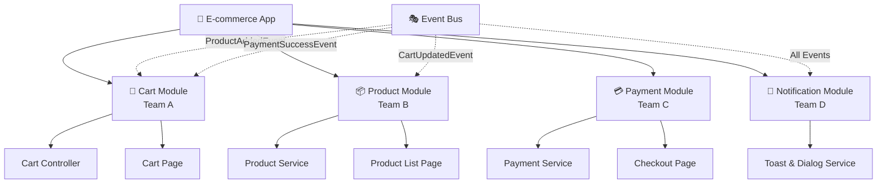

# 🧩 Micro Frontend Architecture

GoRouter Modular is **perfect for micro frontend architecture**, enabling teams to work independently on different features while maintaining seamless integration.

## 🎯 What is Micro Frontend?

Micro Frontend is an architectural pattern where a **single application is built by multiple teams**, each working on **independent modules** that can be developed, tested, and deployed separately.

## 🏗️ Architecture Overview



## 🚀 Team Independence

### **Cart Module (Team A)**
```dart
class CartModule extends EventModule {
  @override
  FutureOr<List<Bind<Object>>> binds() => [
    Bind.singleton<CartController>((i) => CartController()),
    Bind.singleton<CartService>((i) => CartService()),
  ];

  @override
  List<ModularRoute> get routes => [
    ChildRoute('/', child: (context, state) => CartPage()),
    ChildRoute('/checkout', child: (context, state) => CheckoutPage()),
  ];

  @override
  void listen() {
    on<ProductAddedEvent>((event, context) {
      // Add to cart logic
      final cartController = Modular.get<CartController>();
      cartController.addProduct(event.product, event.quantity);
      
      // Notify other modules
      ModularEvent.fire(CartUpdatedEvent());
    });
    
    on<PaymentSuccessEvent>((event, context) {
      // Clear cart after successful payment
      final cartController = Modular.get<CartController>();
      cartController.clearCart();
    });
  }
}
```

### **Product Module (Team B)**
```dart
class ProductModule extends EventModule {
  @override
  FutureOr<List<Bind<Object>>> binds() => [
    Bind.singleton<ProductController>((i) => ProductController()),
    Bind.singleton<ProductService>((i) => ProductService()),
  ];

  @override
  List<ModularRoute> get routes => [
    ChildRoute('/', child: (context, state) => ProductListPage()),
    ChildRoute('/:id', child: (context, state) => ProductDetailPage()),
  ];

  @override
  void listen() {
    on<CartUpdatedEvent>((event, context) {
      // Update product availability based on cart
      final productController = Modular.get<ProductController>();
      productController.updateAvailability();
    });
  }
}
```

### **Payment Module (Team C)**
```dart
class PaymentModule extends EventModule {
  @override
  FutureOr<List<Bind<Object>>> binds() => [
    Bind.singleton<PaymentController>((i) => PaymentController()),
    Bind.singleton<PaymentService>((i) => PaymentService()),
  ];

  @override
  List<ModularRoute> get routes => [
    ChildRoute('/', child: (context, state) => PaymentPage()),
    ChildRoute('/success', child: (context, state) => PaymentSuccessPage()),
  ];

  @override
  void listen() {
    on<CartUpdatedEvent>((event, context) {
      // Update payment totals
      final paymentController = Modular.get<PaymentController>();
      paymentController.updateTotals();
    });
  }
}
```

## 🔄 Event-Driven Communication

### **Event Flow Example**
```dart
// 1. User adds product (Product Module)
class ProductDetailPage extends StatelessWidget {
  @override
  Widget build(BuildContext context) {
    return ElevatedButton(
      onPressed: () {
        // Fire event to add product to cart
        ModularEvent.fire(ProductAddedEvent(
          product: product,
          quantity: 1,
        ));
      },
      child: Text('Add to Cart'),
    );
  }
}

// 2. Cart Module receives event
on<ProductAddedEvent>((event, context) {
  addToCart(event.product, event.quantity);
  ModularEvent.fire(CartUpdatedEvent());
});

// 3. Other modules react to cart update
on<CartUpdatedEvent>((event, context) {
  // Update availability, totals, etc.
});
```

## 🎯 Benefits for Teams

### **🔄 Decoupled Communication**
- Teams develop independently
- No direct module dependencies
- Communication through events

### **📡 Event-driven Integration**
- Seamless module communication
- Loose coupling between modules
- Easy to add new modules

### **🧪 Easy Testing**
- Test modules in isolation
- Mock events for testing
- Independent test suites

### **📦 Independent Deployment**
- Deploy modules separately
- Different release cycles
- Reduced deployment risk

### **🛡️ Type Safety**
- Compile-time error detection
- Excellent IDE support
- Refactoring safety

## 🏗️ Project Structure

### **Team-Based Organization**
```
📁 lib/
  📁 src/
    📁 modules/
      📁 cart/           # Team A
        📄 cart_module.dart
        📄 cart_controller.dart
        📁 pages/
          📄 cart_page.dart
        📁 services/
          📄 cart_service.dart
      📁 product/        # Team B
        📄 product_module.dart
        📄 product_controller.dart
        📁 pages/
          📄 product_list_page.dart
        📁 services/
          📄 product_service.dart
      📁 payment/        # Team C
        📄 payment_module.dart
        📄 payment_controller.dart
        📁 pages/
          📄 payment_page.dart
        📁 services/
          📄 payment_service.dart
      📁 shared/         # Shared across teams
        📄 shared_module.dart
        📁 events/
          📄 app_events.dart
        📁 services/
          📄 api_service.dart
```

### **Shared Events**
```dart
// lib/src/modules/shared/events/app_events.dart
class ProductAddedEvent {
  final Product product;
  final int quantity;
  
  ProductAddedEvent(this.product, this.quantity);
}

class CartUpdatedEvent {
  final int itemCount;
  final double total;
  
  CartUpdatedEvent({this.itemCount = 0, this.total = 0.0});
}

class PaymentSuccessEvent {
  final String orderId;
  final double amount;
  
  PaymentSuccessEvent(this.orderId, this.amount);
}
```

## 🚀 Development Workflow

### **1. Team Setup**
```dart
// Each team works on their module independently
class CartModule extends EventModule {
  // Team A owns this module
  // Can modify without affecting other teams
}
```

### **2. Event Contracts**
```dart
// Teams agree on event contracts
class ProductAddedEvent {
  final Product product;  // Required by Cart Module
  final int quantity;     // Required by Cart Module
  
  ProductAddedEvent(this.product, this.quantity);
}
```

### **3. Integration Testing**
```dart
// Test module integration through events
void main() {
  test('Cart updates when product is added', () {
    // Setup
    Modular.configure(appModule: TestAppModule());
    
    // Act
    ModularEvent.fire(ProductAddedEvent(product, 1));
    
    // Assert
    final cartController = Modular.get<CartController>();
    expect(cartController.itemCount, 1);
  });
}
```

## 🛡️ Best Practices

### **1. Clear Module Boundaries**
```dart
// ✅ Good - Clear responsibility
class CartModule extends EventModule {
  // Only cart-related functionality
  // Clear public API through events
}

// ❌ Avoid - Mixed responsibilities
class CartModule extends EventModule {
  // Don't mix cart + payment + product logic
}
```

### **2. Event-First Design**
```dart
// ✅ Good - Design around events
class ProductModule extends EventModule {
  @override
  void listen() {
    on<CartUpdatedEvent>((event, context) {
      // React to cart changes
    });
  }
}

// ❌ Avoid - Direct module dependencies
class ProductModule extends Module {
  // Don't directly import CartModule
}
```

### **3. Shared Contracts**
```dart
// ✅ Good - Shared event definitions
// lib/src/modules/shared/events/app_events.dart
class ProductAddedEvent {
  final Product product;
  final int quantity;
  
  ProductAddedEvent(this.product, this.quantity);
}

// ❌ Avoid - Duplicate event definitions
// Each module defining their own events
```

## 📚 Related Topics

- 🎭 [Event System](./event-system) - Module communication
- 🏗️ [Project Structure](./project-structure) - Team organization
- 💉 [Dependency Injection](./dependency-injection) - Module dependencies 