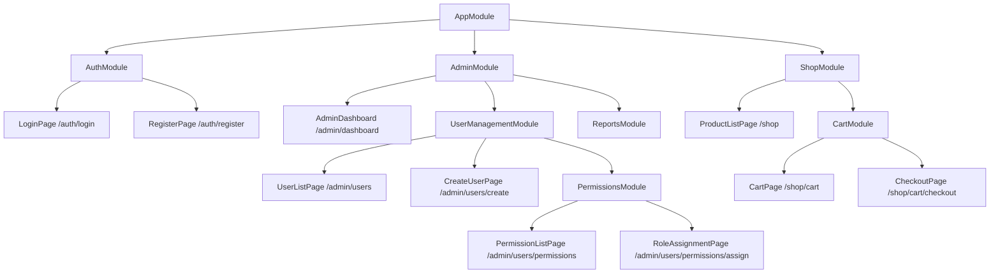

# GoRouter Modular: Complete Routes Technical Documentation

A comprehensive guide to routing, navigation, and module architecture with GoRouter Modular.

## Table of Contents

- [Overview](#overview)
- [Route Types](#route-types)
- [ChildRoute vs ModuleRoute](#childroute-vs-moduleroute)
- [Shell Modules](#shell-modules)
- [Page Transitions](#page-transitions)
- [Navigation](#navigation)
- [Route Parameters](#route-parameters)
- [Module Nesting](#module-nesting)
- [Advanced Patterns](#advanced-patterns)
- [Best Practices](#best-practices)
- [Examples](#examples)

## Overview

GoRouter Modular provides seamless integration with GoRouter for powerful, type-safe navigation. It extends the traditional routing concept with modular architecture, allowing you to build scalable applications with clear separation of concerns.

### Key Benefits

- ✅ **Type-Safe Navigation** - Compile-time route verification
- ✅ **Modular Architecture** - Organize routes by features/modules
- ✅ **Dependency Injection** - Module-scoped bindings
- ✅ **Shell Layouts** - Shared UI structures across routes
- ✅ **Nested Modules** - Unlimited nesting for complex apps
- ✅ **Async Navigation** - Loading states and async route handling

## Route Types

GoRouter Modular supports three main route types, each serving different architectural needs:

### 1. ChildRoute - Simple Page Routes

**Purpose**: Define individual pages/screens in your application.

```dart
class HomeModule extends Module {
  @override
  List<ModularRoute> get routes => [
    ChildRoute('/', child: (context, state) => HomePage()),
    ChildRoute('/profile', child: (context, state) => ProfilePage()),
    ChildRoute('/user/:id', child: (context, state) => 
      UserPage(id: state.pathParameters['id']!)),
  ];
}
```

**When to use:**
- ✅ Individual pages/screens (e.g., Home, Profile, Settings)
- ✅ Simple navigation without grouping needs
- ✅ Standalone pages with no shared dependencies

### 2. ModuleRoute - Nested Modules

**Purpose**: Group related routes and manage shared dependencies.

```dart
class AppModule extends Module {
  @override
  List<ModularRoute> get routes => [
    ModuleRoute("/", module: HomeModule()),
    ModuleRoute("/auth", module: AuthModule()),
    ModuleRoute("/user", module: UserModule()),
  ];
}
```

**When to use:**
- ✅ Group related routes (e.g., all user-related pages)
- ✅ Inject shared dependencies among route sets
- ✅ Large apps with multiple features or teams
- ✅ Modular architecture with clear boundaries

### 3. ShellModularRoute - Shared Layouts

**Purpose**: Create persistent layouts that wrap multiple child routes.

```dart
class ShellModule extends Module {
  @override
  List<ModularRoute> get routes => [
    ShellModularRoute(
      builder: (context, state, child) => ShellPage(child: child),
      routes: [
        ChildRoute("/dashboard", child: (context, state) => DashboardPage()),
        ChildRoute("/settings", child: (context, state) => SettingsPage()),
        ChildRoute("/profile", child: (context, state) => ProfilePage()),
      ],
    ),
  ];
}
```

**When to use:**
- ✅ Persistent navigation bars (bottom/tab/side)
- ✅ Dashboards and admin panels
- ✅ Apps with complex navigation hierarchies
- ✅ Keep state/widgets alive while navigating

## ChildRoute vs ModuleRoute

### Detailed Comparison

| Aspect | ChildRoute | ModuleRoute |
|--------|------------|-------------|
| **Purpose** | Single page/screen | Group of routes (feature/module) |
| **Dependencies** | No shared bindings | Can inject shared bindings |
| **Nesting** | Cannot contain other routes | Can contain ChildRoutes, Shells, etc |
| **Use Case** | Simple navigation | Modular, scalable architecture |
| **State Management** | Page-scoped | Module-scoped |
| **Team Ownership** | Individual developers | Feature teams |
| **Testing** | Page-level tests | Module-level integration tests |

### ChildRoute Examples

```dart
// Simple pages
class SimpleModule extends Module {
  @override
  List<ModularRoute> get routes => [
    // Static route
    ChildRoute('/about', child: (context, state) => AboutPage()),
    
    // Dynamic route with parameters
    ChildRoute('/product/:id', child: (context, state) => ProductPage(
      productId: state.pathParameters['id']!,
    )),
    
    // Route with query parameters
    ChildRoute('/search', child: (context, state) => SearchPage(
      query: state.queryParameters['q'] ?? '',
      category: state.queryParameters['category'],
    )),
    
    // Route with extra data
    ChildRoute('/checkout', child: (context, state) => CheckoutPage(
      cartData: state.extra as CartData?,
    )),
  ];
}
```

### ModuleRoute Examples

```dart
// Feature-based modules
class ECommerceModule extends Module {
  @override
  List<Module> get imports => [
    ProductModule(),
    CartModule(),
    CheckoutModule(),
  ];

  @override
  List<ModularRoute> get routes => [
    ModuleRoute('/products', module: ProductModule()),
    ModuleRoute('/cart', module: CartModule()),
    ModuleRoute('/checkout', module: CheckoutModule()),
  ];

  @override
  FutureOr<List<Bind<Object>>> binds() => [
    // Shared dependencies for all e-commerce modules
    Bind.singleton<ECommerceService>((i) => ECommerceService()),
    Bind.singleton<PaymentService>((i) => PaymentService()),
  ];
}

// Individual feature modules
class ProductModule extends Module {
  @override
  List<ModularRoute> get routes => [
    ChildRoute('/', child: (context, state) => ProductListPage()),
    ChildRoute('/:id', child: (context, state) => ProductDetailPage()),
    ChildRoute('/:id/reviews', child: (context, state) => ProductReviewsPage()),
  ];

  @override
  FutureOr<List<Bind<Object>>> binds() => [
    // Product-specific dependencies
    Bind.singleton<ProductRepository>((i) => ProductRepository()),
    Bind.factory<ProductBloc>((i) => ProductBloc()),
  ];
}
```

## Shell Modules

### What is a Shell Module?

A Shell Module is a special type of module that wraps a set of routes with a common UI structure. It uses `ShellModularRoute` to define a shared layout and manage navigation between its child routes.

> **⚠️ Important Warning**
> A Shell Module cannot have a `/` (root) route. Defining a root route inside a Shell Module will cause navigation errors and is not supported. Always use specific subpaths (e.g., `/dashboard`, `/settings`) for child routes inside a shell.

### Basic Shell Implementation

```dart
class ShellModule extends Module {
  @override
  List<ModularRoute> get routes => [
    ShellModularRoute(
      builder: (context, state, child) => ShellPage(child: child),
      routes: [
        ChildRoute('/dashboard', child: (context, state) => DashboardPage()),
        ChildRoute('/settings', child: (context, state) => SettingsPage()),
        ChildRoute('/profile', child: (context, state) => ProfilePage()),
      ],
    ),
  ];
}
```

### Shell Page Implementation

```dart
class ShellPage extends StatelessWidget {
  final Widget child;
  
  const ShellPage({required this.child, Key? key}) : super(key: key);

  @override
  Widget build(BuildContext context) {
    return Scaffold(
      appBar: AppBar(
        title: Text('Shell Example'),
        actions: [
          IconButton(
            icon: Icon(Icons.notifications),
            onPressed: () => context.push('/notifications'),
          ),
        ],
      ),
      body: child, // Current route content
      bottomNavigationBar: BottomNavigationBar(
        currentIndex: _getCurrentIndex(context),
        items: const [
          BottomNavigationBarItem(
            icon: Icon(Icons.dashboard),
            label: 'Dashboard',
          ),
          BottomNavigationBarItem(
            icon: Icon(Icons.settings),
            label: 'Settings',
          ),
          BottomNavigationBarItem(
            icon: Icon(Icons.person),
            label: 'Profile',
          ),
        ],
        onTap: (index) => _onTabTapped(context, index),
      ),
    );
  }

  int _getCurrentIndex(BuildContext context) {
    final location = GoRouterState.of(context).location;
    switch (location) {
      case '/dashboard':
        return 0;
      case '/settings':
        return 1;
      case '/profile':
        return 2;
      default:
        return 0;
    }
  }

  void _onTabTapped(BuildContext context, int index) {
    switch (index) {
      case 0:
        context.go('/dashboard');
        break;
      case 1:
        context.go('/settings');
        break;
      case 2:
        context.go('/profile');
        break;
    }
  }
}
```

### Advanced Shell Patterns

#### Nested Shells

```dart
class MainShellModule extends Module {
  @override
  List<ModularRoute> get routes => [
    ShellModularRoute(
      builder: (context, state, child) => MainShell(child: child),
      routes: [
        // Nested shell for admin area
        ModuleRoute('/admin', module: AdminShellModule()),
        
        // Regular child routes
        ChildRoute('/home', child: (context, state) => HomePage()),
        ChildRoute('/profile', child: (context, state) => ProfilePage()),
      ],
    ),
  ];
}

class AdminShellModule extends Module {
  @override
  List<ModularRoute> get routes => [
    ShellModularRoute(
      builder: (context, state, child) => AdminShell(child: child),
      routes: [
        ChildRoute('/dashboard', child: (context, state) => AdminDashboardPage()),
        ChildRoute('/users', child: (context, state) => UserManagementPage()),
        ChildRoute('/reports', child: (context, state) => ReportsPage()),
      ],
    ),
  ];
}
```

#### Conditional Shell

```dart
class ConditionalShellPage extends StatelessWidget {
  final Widget child;
  
  const ConditionalShellPage({required this.child, Key? key}) : super(key: key);

  @override
  Widget build(BuildContext context) {
    final user = context.read<UserService>().currentUser;
    
    return Scaffold(
      appBar: AppBar(title: Text('App Title')),
      body: child,
      // Show different navigation based on user role
      bottomNavigationBar: user?.isAdmin == true 
        ? _buildAdminNavigation(context)
        : _buildUserNavigation(context),
      drawer: user?.hasDrawerAccess == true 
        ? _buildDrawer(context) 
        : null,
    );
  }

  Widget _buildAdminNavigation(BuildContext context) {
    // Admin-specific navigation
    return BottomNavigationBar(
      type: BottomNavigationBarType.fixed,
      items: const [
        BottomNavigationBarItem(icon: Icon(Icons.dashboard), label: 'Dashboard'),
        BottomNavigationBarItem(icon: Icon(Icons.people), label: 'Users'),
        BottomNavigationBarItem(icon: Icon(Icons.analytics), label: 'Analytics'),
        BottomNavigationBarItem(icon: Icon(Icons.settings), label: 'Settings'),
      ],
      onTap: (index) {
        switch (index) {
          case 0: context.go('/dashboard'); break;
          case 1: context.go('/users'); break;
          case 2: context.go('/analytics'); break;
          case 3: context.go('/settings'); break;
        }
      },
    );
  }

  Widget _buildUserNavigation(BuildContext context) {
    // User-specific navigation
    return BottomNavigationBar(
      items: const [
        BottomNavigationBarItem(icon: Icon(Icons.home), label: 'Home'),
        BottomNavigationBarItem(icon: Icon(Icons.search), label: 'Search'),
        BottomNavigationBarItem(icon: Icon(Icons.person), label: 'Profile'),
      ],
      onTap: (index) {
        switch (index) {
          case 0: context.go('/home'); break;
          case 1: context.go('/search'); break;
          case 2: context.go('/profile'); break;
        }
      },
    );
  }
}
```

## Page Transitions

Go Router Modular integrates with the `go_transitions` package to provide a powerful and flexible page transition system. This allows you to create beautiful, smooth transitions between pages with minimal configuration.

### Overview

The transition system supports:
- **Built-in transitions**: fade, slide, scale, rotate, and more
- **Transition inheritance**: child routes inherit transitions from parent modules
- **Customizable duration and curves**: fine-tune your animations
- **Platform-specific defaults**: automatic fallbacks for different platforms

### Basic Usage

#### Module-Level Transitions

Set transitions at the module level to apply to all child routes:

```dart
class HomeModule extends Module {
  @override
  List<ModularRoute> get routes => [
    ModuleRoute(
      '/',
      module: HomeModule(),
      transition: GoTransitions.fadeUpwards,
      duration: Duration(milliseconds: 300),
    ),
  ];
}
```

#### Child Route Transitions

Override transitions for specific child routes:

```dart
class HomeModule extends Module {
  @override
  List<ModularRoute> get routes => [
    // Inherits fadeUpwards from parent module
    ChildRoute('/', child: (_, __) => HomePage()),
    
    // Overrides with specific transition
    ChildRoute('/details', 
      child: (_, __) => DetailsPage(),
      transition: GoTransitions.slide.toRight.withFade,
      duration: Duration(milliseconds: 400),
    ),
  ];
}
```

### Available Transitions

#### Basic Transitions

```dart
// Fade transitions
GoTransitions.fade
GoTransitions.fadeUpwards
GoTransitions.fadeDownwards

// Slide transitions
GoTransitions.slide.toLeft
GoTransitions.slide.toRight
GoTransitions.slide.toTop
GoTransitions.slide.toBottom

// Scale transitions
GoTransitions.scale
GoTransitions.scale.withFade

// Rotate transitions
GoTransitions.rotate
GoTransitions.rotate.withFade

// Platform-specific
GoTransitions.cupertino  // iOS/macOS style
GoTransitions.material   // Android style
```

#### Transition Modifiers

Combine transitions with modifiers for enhanced effects:

```dart
// Slide with fade
GoTransitions.slide.toRight.withFade

// Scale with rotation
GoTransitions.scale.withRotation

// Slide with scale
GoTransitions.slide.toLeft.withScale
```

### Transition Inheritance

The transition system implements inheritance, allowing child routes to inherit or override parent transitions:

```dart
class AppModule extends Module {
  @override
  List<ModularRoute> get routes => [
    // Parent module with transition
    ModuleRoute(
      '/home',
      module: HomeModule(),
      transition: GoTransitions.fadeUpwards,
      duration: Duration(milliseconds: 300),
    ),
  ];
}

class HomeModule extends Module {
  @override
  List<ModularRoute> get routes => [
    // Inherits fadeUpwards from AppModule
    ChildRoute('/', child: (_, __) => HomePage()),
    
    // Overrides with different transition
    ChildRoute('/profile', 
      child: (_, __) => ProfilePage(),
      transition: GoTransitions.slide.toRight,
      duration: Duration(milliseconds: 400),
    ),
  ];
}
```

### Global Configuration

Configure global default transitions in your app:

```dart
class AppWidget extends StatelessWidget {
  @override
  Widget build(BuildContext context) {
    // Set global defaults
    GoTransition.defaultCurve = Curves.easeInOut;
    GoTransition.defaultDuration = Duration(milliseconds: 400);

    return MaterialApp.router(
      routerConfig: Modular.routerConfig,
      theme: ThemeData(
        // Platform-specific fallbacks
        pageTransitionsTheme: PageTransitionsTheme(
          builders: {
            TargetPlatform.android: GoTransitions.fadeUpwards,
            TargetPlatform.iOS: GoTransitions.cupertino,
            TargetPlatform.macOS: GoTransitions.cupertino,
            TargetPlatform.linux: GoTransitions.fade,
            TargetPlatform.windows: GoTransitions.fade,
          },
        ),
      ),
    );
  }
}
```

### Migration from Previous Versions

If you're migrating from the previous transition system:

```dart
// Before (4.2.x)
ChildRoute('/', child: (_, __) => HomePage(), transition: PageTransition.fade)

// After (5.0.x)
ChildRoute('/', child: (_, __) => HomePage(), transition: GoTransitions.fade)
```

> **Note**: For more detailed examples and advanced usage patterns, see the [Page Transitions Examples](/routes/transitions/examples) section.

## Navigation

### Basic Navigation Methods

```dart
// Navigate to route (replaces current route)
context.go('/user/123');

// Push route onto stack
context.push('/modal');

// Pop current route from stack
context.pop();

// Replace current route
context.replace('/new-route');

// Go back to previous route
context.goBack();

// Clear stack and navigate
context.pushReplacement('/login');
```

### Navigation with Data

```dart
// Path parameters
context.go('/user/123');

// Query parameters
context.go('/search?q=flutter&category=mobile');

// Extra data (type-safe)
context.go('/checkout', extra: CartData(
  items: items,
  total: 99.99,
));

// Named parameters with extra data
context.goNamed(
  'user-profile',
  pathParameters: {'userId': '123'},
  queryParameters: {'tab': 'settings'},
  extra: {'metadata': userData},
);
```

### Async Navigation

```dart
class AsyncNavigationExample extends StatefulWidget {
  @override
  State<AsyncNavigationExample> createState() => _AsyncNavigationExampleState();
}

class _AsyncNavigationExampleState extends State<AsyncNavigationExample> {
  bool _isLoading = false;

  Future<void> _navigateToHeavyPage() async {
    setState(() => _isLoading = true);
    
    try {
      // Show loading while navigation and module initialization happens
      await context.goAsync('/heavy-page');
    } catch (error) {
      // Handle navigation errors
      ScaffoldMessenger.of(context).showSnackBar(
        SnackBar(content: Text('Navigation failed: $error')),
      );
    } finally {
      if (mounted) {
        setState(() => _isLoading = false);
      }
    }
  }

  @override
  Widget build(BuildContext context) {
    return ElevatedButton(
      onPressed: _isLoading ? null : _navigateToHeavyPage,
      child: _isLoading 
        ? CircularProgressIndicator()
        : Text('Navigate to Heavy Page'),
    );
  }
}
```

### Programmatic Navigation

```dart
class NavigationService {
  static late GoRouter _router;
  
  static void initialize(GoRouter router) {
    _router = router;
  }

  // Navigate from anywhere in the app
  static void goToLogin() {
    _router.go('/auth/login');
  }

  static void goToProfile(String userId) {
    _router.go('/user/$userId/profile');
  }

  static void showModal(Widget content) {
    _router.push('/modal', extra: content);
  }

  // Navigation with validation
  static Future<bool> goToSecurePage(String route) async {
    final isAuthenticated = await AuthService.isAuthenticated();
    
    if (isAuthenticated) {
      _router.go(route);
      return true;
    } else {
      _router.go('/auth/login');
      return false;
    }
  }
}
```

## Route Parameters

### Path Parameters

```dart
// Define routes with parameters
class UserModule extends Module {
  @override
  List<ModularRoute> get routes => [
    // Single parameter
    ChildRoute('/user/:id', child: (context, state) => UserPage(
      userId: state.pathParameters['id']!,
    )),
    
    // Multiple parameters
    ChildRoute('/user/:userId/post/:postId', child: (context, state) => PostPage(
      userId: state.pathParameters['userId']!,
      postId: state.pathParameters['postId']!,
    )),
    
    // Optional parameters
    ChildRoute('/product/:id/:variant?', child: (context, state) => ProductPage(
      productId: state.pathParameters['id']!,
      variant: state.pathParameters['variant'],
    )),
  ];
}

// Navigate with parameters
context.go('/user/123');
context.go('/user/123/post/456');
context.go('/product/abc123/red');
```

### Query Parameters

```dart
// Access query parameters in routes
ChildRoute('/search', child: (context, state) {
  final query = state.queryParameters['q'] ?? '';
  final category = state.queryParameters['category'];
  final sortBy = state.queryParameters['sort'] ?? 'relevance';
  final page = int.tryParse(state.queryParameters['page'] ?? '1') ?? 1;
  
  return SearchPage(
    query: query,
    category: category,
    sortBy: sortBy,
    page: page,
  );
});

// Navigate with query parameters
context.go('/search?q=flutter&category=mobile&sort=date&page=2');

// Build query parameters programmatically
final queryParams = {
  'q': searchQuery,
  'category': selectedCategory,
  'sort': sortOrder,
  'page': currentPage.toString(),
};

final uri = Uri(
  path: '/search',
  queryParameters: queryParams,
);

context.go(uri.toString());
```

### Extra Data (Type-Safe)

```dart
// Define data classes
class UserData {
  final String id;
  final String name;
  final String email;
  
  UserData({required this.id, required this.name, required this.email});
}

// Pass extra data
context.go('/user-profile', extra: UserData(
  id: '123',
  name: 'John Doe',
  email: 'john@example.com',
));

// Receive extra data
ChildRoute('/user-profile', child: (context, state) {
  final userData = state.extra as UserData?;
  
  return UserProfilePage(userData: userData);
});

// Safe extra data handling
ChildRoute('/checkout', child: (context, state) {
  final cartData = state.extra as CartData?;
  
  if (cartData == null) {
    // Redirect to cart if no data provided
    WidgetsBinding.instance.addPostFrameCallback((_) {
      context.go('/cart');
    });
    return SizedBox.shrink();
  }
  
  return CheckoutPage(cartData: cartData);
});
```

## Module Nesting

### Basic Nesting Structure

```dart
// Root application module
class AppModule extends Module {
  @override
  List<ModularRoute> get routes => [
    ModuleRoute('/', module: HomeModule()),
    ModuleRoute('/auth', module: AuthModule()),
    ModuleRoute('/admin', module: AdminModule()),
    ModuleRoute('/shop', module: ShopModule()),
  ];

  @override
  FutureOr<List<Bind<Object>>> binds() => [
    // App-wide dependencies
    Bind.singleton<ApiService>((i) => ApiService()),
    Bind.singleton<AuthService>((i) => AuthService()),
  ];
}

// Feature modules can contain sub-modules
class AdminModule extends Module {
  @override
  List<ModularRoute> get routes => [
    ChildRoute('/dashboard', child: (context, state) => AdminDashboard()),
    ModuleRoute('/users', module: UserManagementModule()),
    ModuleRoute('/reports', module: ReportsModule()),
    ModuleRoute('/settings', module: AdminSettingsModule()),
  ];

  @override
  FutureOr<List<Bind<Object>>> binds() => [
    // Admin-specific dependencies
    Bind.singleton<AdminService>((i) => AdminService()),
    Bind.factory<AdminRepository>((i) => AdminRepository()),
  ];
}

// Deep nesting example
class UserManagementModule extends Module {
  @override
  List<ModularRoute> get routes => [
    ChildRoute('/', child: (context, state) => UserListPage()),
    ChildRoute('/create', child: (context, state) => CreateUserPage()),
    ModuleRoute('/permissions', module: PermissionsModule()),
    ModuleRoute('/roles', module: RolesModule()),
  ];
}
```

### Navigation Flow Example



### Module Communication

```dart
// Modules can communicate through dependency injection
class ShopModule extends Module {
  @override
  List<ModularRoute> get routes => [
    ChildRoute('/', child: (context, state) => ProductListPage()),
    ModuleRoute('/cart', module: CartModule()),
    ModuleRoute('/checkout', module: CheckoutModule()),
  ];

  @override
  FutureOr<List<Bind<Object>>> binds() => [
    // Shared shopping dependencies
    Bind.singleton<ShoppingCartService>((i) => ShoppingCartService()),
    Bind.singleton<ProductService>((i) => ProductService()),
  ];
}

class CartModule extends Module {
  @override
  List<ModularRoute> get routes => [
    ChildRoute('/', child: (context, state) => CartPage()),
    ChildRoute('/checkout', child: (context, state) => CheckoutPage()),
  ];

  @override
  FutureOr<List<Bind<Object>>> binds() => [
    // Cart-specific dependencies that can access shopping services
    Bind.factory<CartBloc>((i) => CartBloc(
      cartService: i.get<ShoppingCartService>(),
      productService: i.get<ProductService>(),
    )),
  ];
}
```

## Advanced Patterns

### Route Guards

```dart
class AuthGuardedRoute extends ModularRoute {
  AuthGuardedRoute(String path, {required Module module}) 
    : super(path, module: module);

  @override
  String? redirect(BuildContext context, GoRouterState state) {
    final authService = Modular.get<AuthService>();
    
    if (!authService.isAuthenticated) {
      return '/auth/login?redirect=${state.location}';
    }
    
    return null; // Allow navigation
  }
}

// Usage
class AdminModule extends Module {
  @override
  List<ModularRoute> get routes => [
    AuthGuardedRoute('/admin', module: AdminPanelModule()),
  ];
}
```

### Dynamic Route Generation

```dart
class DynamicModule extends Module {
  @override
  List<ModularRoute> get routes {
    final routes = <ModularRoute>[];
    
    // Add base routes
    routes.add(ChildRoute('/', child: (context, state) => HomePage()));
    
    // Add feature-specific routes based on configuration
    final features = ConfigService.enabledFeatures;
    
    if (features.contains('shop')) {
      routes.add(ModuleRoute('/shop', module: ShopModule()));
    }
    
    if (features.contains('admin')) {
      routes.add(ModuleRoute('/admin', module: AdminModule()));
    }
    
    if (features.contains('analytics')) {
      routes.add(ModuleRoute('/analytics', module: AnalyticsModule()));
    }
    
    return routes;
  }
}
```

### Route Middleware

```dart
class LoggingMiddleware {
  static String? logNavigation(BuildContext context, GoRouterState state) {
    print('Navigating to: ${state.location}');
    print('Parameters: ${state.pathParameters}');
    print('Query: ${state.queryParameters}');
    
    // Log to analytics service
    AnalyticsService.trackNavigation(state.location);
    
    return null; // Continue navigation
  }
}

class AppModule extends Module {
  @override
  List<ModularRoute> get routes => [
    ChildRoute('/', 
      child: (context, state) => HomePage(),
      redirect: LoggingMiddleware.logNavigation,
    ),
  ];
}
```

## Best Practices

### 1. Module Organization

```dart
// ✅ GOOD: Feature-based modules
class ECommerceModule extends Module {
  @override
  List<Module> get imports => [
    ProductModule(),
    CartModule(),
    CheckoutModule(),
    OrderModule(),
  ];
}

// ❌ BAD: Mixed concerns
class MixedModule extends Module {
  @override
  List<ModularRoute> get routes => [
    ChildRoute('/products', child: (context, state) => ProductsPage()),
    ChildRoute('/users', child: (context, state) => UsersPage()),
    ChildRoute('/analytics', child: (context, state) => AnalyticsPage()),
    // Too many unrelated concerns
  ];
}
```

### 2. Route Naming

```dart
// ✅ GOOD: Clear, hierarchical routes
class UserModule extends Module {
  @override
  List<ModularRoute> get routes => [
    ChildRoute('/', child: (context, state) => UserListPage()),
    ChildRoute('/:id', child: (context, state) => UserDetailPage()),
    ChildRoute('/:id/edit', child: (context, state) => EditUserPage()),
    ChildRoute('/:id/settings', child: (context, state) => UserSettingsPage()),
  ];
}

// ❌ BAD: Unclear, inconsistent routes
class BadUserModule extends Module {
  @override
  List<ModularRoute> get routes => [
    ChildRoute('/list', child: (context, state) => UserListPage()),
    ChildRoute('/details/:id', child: (context, state) => UserDetailPage()),
    ChildRoute('/modify/:userId', child: (context, state) => EditUserPage()),
  ];
}
```

### 3. Dependency Management

```dart
// ✅ GOOD: Proper dependency scoping
class UserModule extends Module {
  @override
  FutureOr<List<Bind<Object>>> binds() => [
    // User-specific dependencies
    Bind.singleton<UserRepository>((i) => UserRepository()),
    Bind.factory<UserBloc>((i) => UserBloc()),
    Bind.lazySingleton<UserCache>((i) => UserCache()),
  ];
}

class AppModule extends Module {
  @override
  FutureOr<List<Bind<Object>>> binds() => [
    // App-wide dependencies
    Bind.singleton<ApiService>((i) => ApiService()),
    Bind.singleton<AuthService>((i) => AuthService()),
  ];
}
```

### 4. Error Handling

```dart
// ✅ GOOD: Comprehensive error handling
class RobustModule extends Module {
  @override
  List<ModularRoute> get routes => [
    ChildRoute('/page', 
      child: (context, state) => PageWidget(),
      redirect: (context, state) {
        try {
          // Validate access
          return _validateAccess(context, state);
        } catch (error) {
          // Log error and redirect to error page
          ErrorService.logError(error);
          return '/error?message=${error.toString()}';
        }
      },
    ),
  ];
}
```

## Examples

### Complete E-commerce Application

```dart
// Main application module
class ECommerceApp extends Module {
  @override
  List<ModularRoute> get routes => [
    // Authentication routes
    ModuleRoute('/auth', module: AuthModule()),
    
    // Main shopping experience with shell
    ModuleRoute('/shop', module: ShopShellModule()),
    
    // User account management
    ModuleRoute('/account', module: AccountModule()),
    
    // Admin panel
    ModuleRoute('/admin', module: AdminModule()),
  ];

  @override
  FutureOr<List<Bind<Object>>> binds() => [
    // Core app services
    Bind.singleton<ApiService>((i) => ApiService()),
    Bind.singleton<AuthService>((i) => AuthService()),
    Bind.singleton<CartService>((i) => CartService()),
  ];
}

// Shopping shell with persistent navigation
class ShopShellModule extends Module {
  @override
  List<ModularRoute> get routes => [
    ShellModularRoute(
      builder: (context, state, child) => ShopShell(child: child),
      routes: [
        ChildRoute('/home', child: (context, state) => HomePage()),
        ChildRoute('/categories', child: (context, state) => CategoriesPage()),
        ModuleRoute('/products', module: ProductModule()),
        ChildRoute('/cart', child: (context, state) => CartPage()),
        ChildRoute('/search', child: (context, state) => SearchPage()),
      ],
    ),
  ];
}

// Product feature module
class ProductModule extends Module {
  @override
  List<ModularRoute> get routes => [
    ChildRoute('/', child: (context, state) => ProductListPage()),
    ChildRoute('/:id', child: (context, state) => ProductDetailPage(
      productId: state.pathParameters['id']!,
    )),
    ChildRoute('/:id/reviews', child: (context, state) => ProductReviewsPage()),
    ChildRoute('/category/:category', child: (context, state) => CategoryPage()),
  ];

  @override
  FutureOr<List<Bind<Object>>> binds() => [
    Bind.singleton<ProductRepository>((i) => ProductRepository()),
    Bind.factory<ProductBloc>((i) => ProductBloc()),
    Bind.lazySingleton<ProductCache>((i) => ProductCache()),
  ];
}

// Shopping shell implementation
class ShopShell extends StatefulWidget {
  final Widget child;
  
  const ShopShell({required this.child, Key? key}) : super(key: key);

  @override
  State<ShopShell> createState() => _ShopShellState();
}

class _ShopShellState extends State<ShopShell> {
  int _selectedIndex = 0;

  @override
  Widget build(BuildContext context) {
    return Scaffold(
      appBar: AppBar(
        title: Text('Shop'),
        actions: [
          IconButton(
            icon: Icon(Icons.search),
            onPressed: () => context.push('/shop/search'),
          ),
          CartIconButton(), // Shows cart count
        ],
      ),
      body: widget.child,
      bottomNavigationBar: BottomNavigationBar(
        type: BottomNavigationBarType.fixed,
        currentIndex: _selectedIndex,
        onTap: _onItemTapped,
        items: const [
          BottomNavigationBarItem(icon: Icon(Icons.home), label: 'Home'),
          BottomNavigationBarItem(icon: Icon(Icons.category), label: 'Categories'),
          BottomNavigationBarItem(icon: Icon(Icons.inventory), label: 'Products'),
          BottomNavigationBarItem(icon: Icon(Icons.shopping_cart), label: 'Cart'),
        ],
      ),
    );
  }

  void _onItemTapped(int index) {
    setState(() => _selectedIndex = index);
    
    switch (index) {
      case 0: context.go('/shop/home'); break;
      case 1: context.go('/shop/categories'); break;
      case 2: context.go('/shop/products'); break;
      case 3: context.go('/shop/cart'); break;
    }
  }
}
```

---

## Conclusion

GoRouter Modular provides a powerful and flexible routing system that scales with your application. By understanding the different route types, module patterns, and navigation techniques, you can build maintainable, testable, and scalable Flutter applications.

**Key Takeaways:**
- ✅ Use **ChildRoute** for simple pages
- ✅ Use **ModuleRoute** for feature grouping and dependency management
- ✅ Use **ShellModularRoute** for persistent layouts
- ✅ Leverage module nesting for complex applications
- ✅ Follow naming conventions and organizational patterns
- ✅ Implement proper error handling and route guards

---

*"Great architecture is about making complexity simple, and GoRouter Modular routes make navigation simple."* 🛣️
